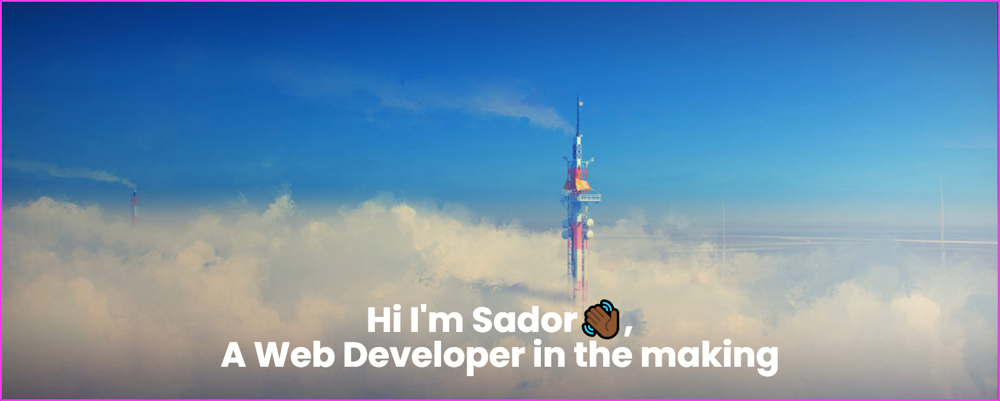
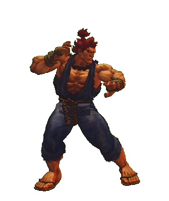

 

 

# About Me

- I am an aspiring self-taught front-end developer who is currently focusing on my core frontend skills. I have been using Frontend Mentor to build and complete the challnges set. I aspire to be a lead frontend developer as I enjoy building web apps with a good UI/UX design

- I currently work nights as a Night Receptionist so I would regard myself a night owl🦉

- Away from web development, I enjoy playing Street Fighter and competing in tournaments

- I speak Tigrinya as my parents are from Eritrea🌍😄

 

# **TechStack** 💻

# Connect with me       

<a href="mailto:zerezghi@live.co.uk">

<a/>
