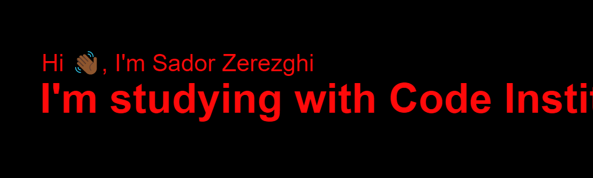

I'm a Full Stack Development Student with Code Institute.

# **Technologies and Tools** 💻

-  HTML 5

- <link rel="stylesheet" href="https://cdn.jsdelivr.net/gh/devicons/devicon@v2.12.0/devicon.min.css"> CSS

-  JavaScript

 | CSS3 | JavaScript | Python | jQuery | mongoDB | django
